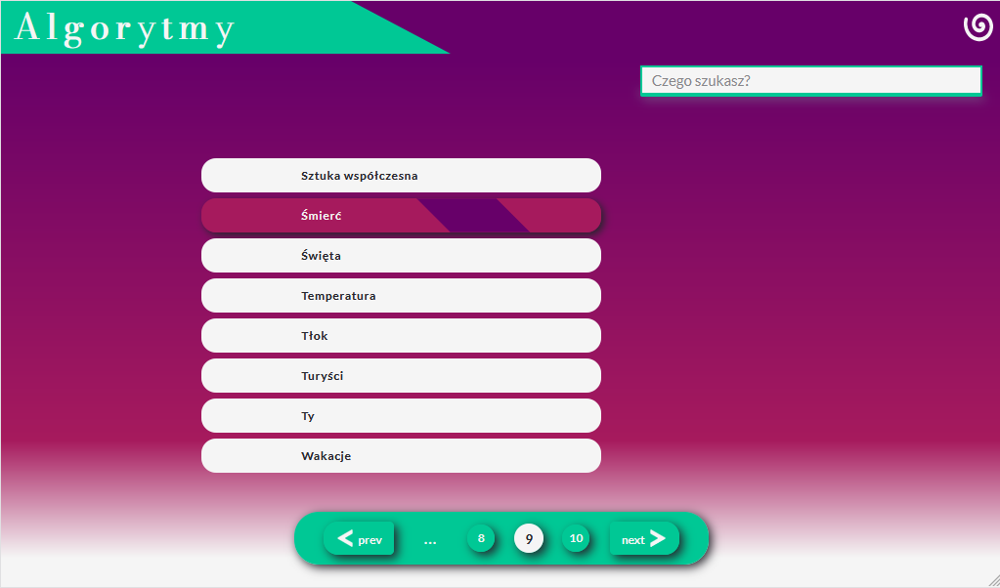
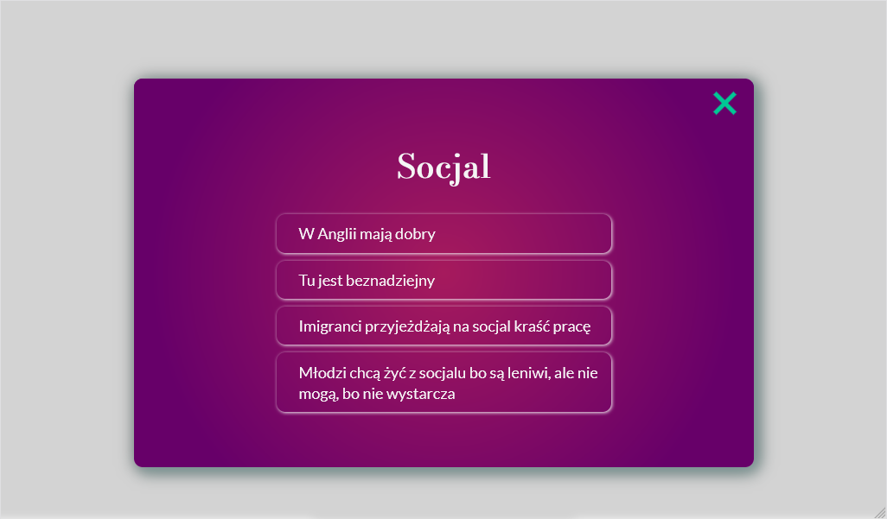

# Conversationals

## Handy lexicon of Polish vernacular culture

## Project description
It is exclusively Polish-language project, created to give people with low communication skills a hand.
Here you can see a database that contains sentences you can use in random, everyday communication: when you are standing in line with strangers or during a holiday with your family. "Conversationals" is your rescue - just peek at the screen and you will immediately know what to say when your beloved granny mentions subjects such as Antibiotics, Jews or Chip Cards.

## Project tech and architecture
This project logic is based on communication with JSON-organized database stored online and fetched with JS. 
For users who are looking for a particular subject I made an search-input which lets them find what they need without searching through paginated list.
The code has been written in vanilla JS, with no frameworks. Although, I did use a Gsap library to animate project intro a little bit.
To code layout I did use SCSS features and then processed it with Gulp.js.

Have fun finding and using comments that will guarantee nothing less than respect of your interlocutors!
Here you can find the project demo: [Algorytmy konwersacyjne](https://pokorra.github.io/conversationals-api)
